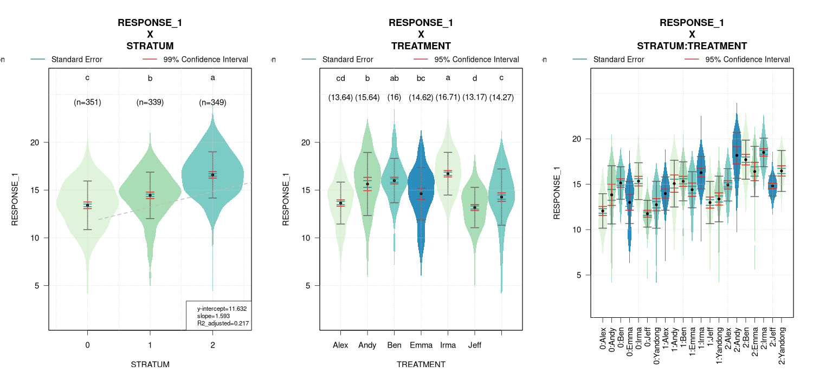

# violinplotter
## Plotting and Comparing Means with Violin Plots

|                                                        **Lab Website**                                                        |                                                               **Build Status**                                                                |                                                                              **Documentation**                                                                               |                                                   **License**                                                   |
|:-----------------------------------------------------------------------------------------------------------------------------:|:---------------------------------------------------------------------------------------------------------------------------------------------:|:----------------------------------------------------------------------------------------------------------------------------------------------------------------------------:|:---------------------------------------------------------------------------------------------------------------:|
| <a href="https://adaptive-evolution.biosciences.unimelb.edu.au/"></a> | [](https://travis-ci.com/jeffersonfparil/violinplotter) | <a href="https://github.com/jeffersonfparil/violinplotter/wiki" target="_blank"></a> | [](https://www.gnu.org/licenses/gpl-3.0) |

An R package for generating violin plots with optional mean comparison with Tukey's honest significant difference and linear regression.
This package aims to b a simple and quick visualization tool for comparing means and assessing trends of categorical factors.

## Usage

```r
violinplotter(formula, data=NULL, TITLE="", XLAB="", YLAB="", VIOLIN_COLOURS=c("#e0f3db", "#ccebc5", "#a8ddb5", "#7bccc4", "#4eb3d3", "#2b8cbe"), ERROR_BAR_COLOURS=c("#636363", "#1c9099", "#de2d26"), XCATEGOR=TRUE, LOGX=FALSE, LOGX_BASE=1, HSDX=TRUE, ALPHA=0.05, REGRESSX=FALSE)
?violinplotter ### for more information
```

## Installation

We are currently working on getting this package available in the [Comprehensive R Archive Network (CRAN)](https://cran.r-project.org/) for ease of installation and greater visibility. But for now please follow the installation instructions below.

```r
### install the "remotes" package to install R packages from github repositories
install.packages("remotes")
### install "violinplotter" (this command also performs package update)
remotes::install_github("jeffersonfparil/violinplotter")
```

## Examples

Simulated dataset:

```r
library(violinplotter)
x1 = rep(rep(rep(c(1:5), each=5), times=5), times=5)
x2 = rep(rep(letters[6:10], each=5*5), times=5)
x3 = rep(letters[11:15], each=5*5*5)
y = rep(1:5, each=5*5*5) + rnorm(rep(1:5, each=5), length(x1)) ### x3 is the variable affecting y (see each=5*5*5)
data = data.frame(x1, x2, x3, y)
OUT_1 = violinplotter(formula=y ~ x1 + x2 + x3 + (x2:x3), data=data, ALPHA=0.05)
OUT_2 = violinplotter(formula=y ~ x1 + x2 + x3 + (x2:x3), data=data, ALPHA=0.001)
OUT_3 = violinplotter(formula=y ~ x1 + x2 + x3 + (x2:x3), data=data, XCATEGOR=c(F,T,T,T), LOGX=c(T,F,F,F), LOGX_BASE=c(2,1,1,1), REGRESSX=c(T,F,F,F))
if (sum(grepl("RColorBrewer", installed.packages()[,1]))!=0){
  OUT_4 = violinplotter(formula=y ~ x1 + x2 + x3 + (x2:x3), data=data, VIOLIN_COLOURS=list(RColorBrewer::brewer.pal(9, "Set1"), RColorBrewer::brewer.pal(9, "Spectral"), RColorBrewer::brewer.pal(9, "GnBu")))
}
```

Dummy dataset:

```r
library(violinplotter)
str(dummy_data)
OUT_1 = violinplotter(formula = RESPONSE_1 ~ STRATUM*TREATMENT, data=dummy_data, XCATEGOR=c(FALSE,TRUE,TRUE), REGRESSX=c(TRUE, FALSE, FALSE), HSD=c(TRUE, TRUE, FALSE))
OUT_2 = violinplotter(formula = RESPONSE_2 ~ STRATUM*TREATMENT, data=dummy_data)
OUT_3 = supressMessages(violinplotter(formula = RESPONSE_2 ~ STRATUM + TREATMENT, data=dummy_data))
```
Sample output figure:

</a>
