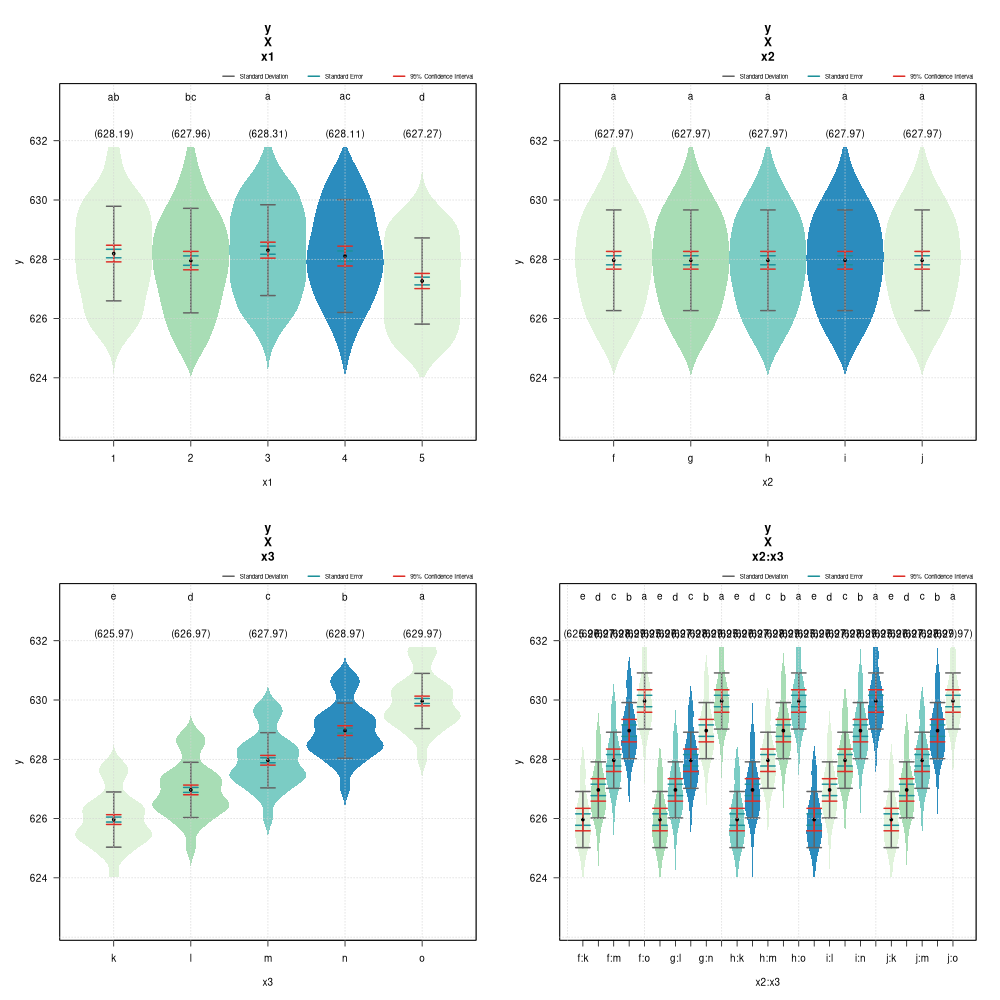
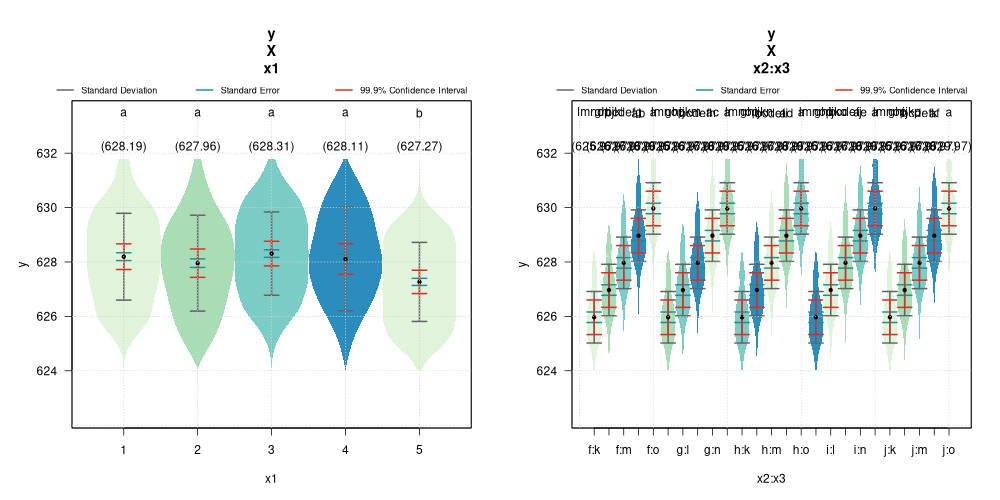
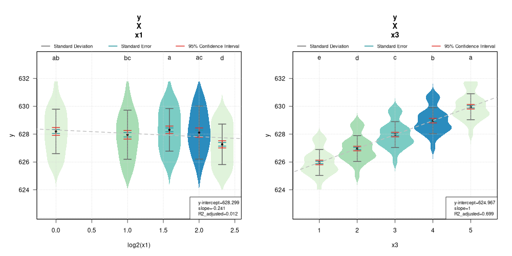

# Summary

violinplotter is an R package for generating violin plots with optional mean comparison with nonparametric Mann-Whitney test or parametric Tukey's honest significant difference test, as well as simple linear regression. This package aims to be a simple and quick visualisation tool for comparing means and assessing trends of categorical variables.


# Statement of need

Biological research often deals with comparing means to identify statistically significant effects between control and treatment groups. The R statistical computing language and environment [@R-2021] comes out of the box with a function to generate boxplots to visualize the differences between groups. More informative violin plots can also be created using the ggplot2 package [@ggplot2-2016]. Statistical significance tests are then performed, such as t-test [@Student-1908], and analysis of variance [@Girdern-1992] to assess the significance of the differences. This is then followed by post-hoc mean comparisons, such as least significant difference [@LSD-2008] and Tukey’s honest significant difference[@Haynes-2013] tests to rank and cluster the groups according to the significance of their pairwise differences. The aim of violinplotter is to automate this multi-step process to rapidly visualize and assess the ranking and significant differences between groups with a single R command. 

violinplotter is a lightweight package without any dependencies and uses base R tooling to draw the violin plots and perform the statistical tests. It has been deposited on the (comprehensive R archive network)[https://cran.r-project.org/web/packages/violinplotter/index.html] and is being maintained on (github)[https://github.com/jeffersonfparil/violinplotter].


# Examples

As demonstration, simulated data were generated, violin plots created, mean comparisons, log-transformation, and linear regression performed.

```
library(violinplotter)
set.seed(123)
x1 = rep(rep(rep(c(1:5), each=5), times=5), times=5)
x2 = rep(rep(letters[6:10], each=5*5), times=5)
x3 = rep(letters[11:15], each=5*5*5)
y = rep(1:5, each=5*5*5) + rnorm(rep(1:5, each=5), length(x1)) ### x3 is the variable affecting y (see each=5*5*5)
```

Global variables can be use to specify the response and explanatory variables.
```
OUT_1 = violinplotter(y ~ x3, ALPHA=0.05)
```


Multiple violin plots are generated if multiple explanatory variable are specified including interaction variables (specified with ":" notation).
```
OUT_2 = violinplotter(y ~ x1 + x2 + x3 + x2:x3, ALPHA=0.05)
```



A dataframe can be used to specify the variables.
```
data = data.frame(x1, x2, x3, y)
OUT_3 = violinplotter(formula=y ~ x1 + x3, data=data, ALPHA=0.001)
```



Explanatory variables can be treated as numeric, log-transformed, and/or linear regression performed.
```
OUT_4 = violinplotter(formula=y ~ x1 + x3, data=data, CATEGORICAL=c(F,F), LOGX=c(T,F), LOGX_BASE=c(2,1), REGRESS=c(T,T), SHOW_MEANS=c(F,F))
```


# References

